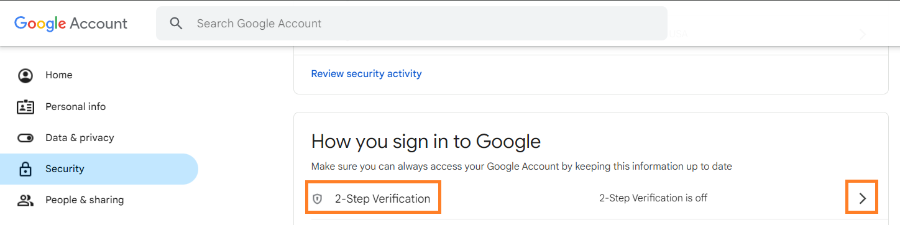

# Secret Santa Generator With Automated Emailing

Randomizing players to Secret Santa is a very straight forward process that is easily accomplished using Python.  This code does exactly that but also:

1. Adds the convenience of importing the names already integrated into an Excel sheet
2. Automates emailing Secret Santas their recipient's name

This program (APP) _optionally_ uses Gmail to automate the emailing process; but technically, you can use almost any server that uses SMTP for emailing.

To run the program, go to the folder you downloaded/cloned the git and from the command line type:

`python3 secret_santa_generator.py`

If you chose to use the Gmail feature, follow the steps below to set up the 2-Step Verification (MFA) and obtain an APP password.

### Set up 2-Step Verification for the Gmail account

1. Click on the following link:  https://myaccount.google.com/
2. On the left panel, click on "Security"
    

    
    

3. Scroll down to "How you sign in to Google" then click on the right arrow next to "2-Step Verification"
    

    
    

4. Click on "Get started" and go through the prompts for setting up 2-factor authentication
    

    
    

### Obtain an APP password
This random 16-character password will be used in lieu of your actual Gmail account password.  You will need this to email Santas their recipient's name.

⚠️ MAKE SURE YOU DELETE THE APP PASSWORD ONCE DONE! ⚠️

1. Click on the following link:  https://myaccount.google.com/
2. On the left panel, click on "Security"
3. Scroll down to "How you sign in to Google" then click on the right arrow next to "2-Step Verification" (you may be asked to enter your Gmail account password)
4. Scroll down to "App passwords" then click on the right arrow
    

    
    

5. Create an App name (e.g., secret_santa)
    

    
    

    
    A pop-up with your APP password will appear.  This is the password you will use in the program.
    

    
    

6. Once you're done emailing your Santas, delete the App Password by clicking on the trash icon
    

    
    

    

